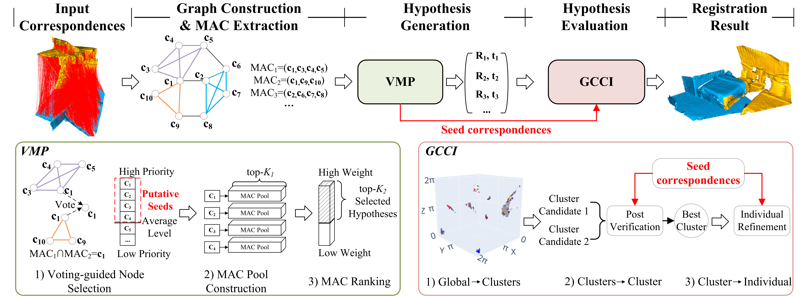

# MAC++: Going Further with Maximal Cliques for 3D Registration
Source code of [MAC++: Going Further with Maximal Cliques for 3D Registration](https://openreview.net/forum?id=dOpxroaprM).
<div align="center">
    
</div>

## Introduction
Maximal cliques (MAC) represent a novel state-of-the-art approach for 3D registration from correspondences, however, it still suffers from extremely severe outliers. In this paper, we introduce a robust learning-free estimator called MAC++, exploring maximal cliques for 3D registration from the following two perspectives:
1) A novel hypothesis generation method utilizing putative seeds through voting to guide the construction of maximal clique pools, effectively preserving more potential correct hypotheses. 
2) A progressive hypothesis evaluation method that continuously reduces the solution space in a ''global-clusters-cluster-individual'' manner rather than traditional one-shot techniques, greatly alleviating the issue of missing good hypotheses. 

Experiments conducted on U3M, 3DMatch/3DLoMatch, and KITTI-LC datasets show the new state-of-the-art performance of MAC++. MAC++ demonstrates the capability to handle extremely low inlier ratio data where MAC fails (e.g., showing **27.1\%/30.6\%** registration recall improvements on 3DMatch/3DLoMatch with **<1\%** inliers).
<div align="center">
    
</div>

## Build
MAC depends on [PCL](https://github.com/PointCloudLibrary/pcl/tags) (version `1.12.1` is recommended) and [igraph](https://github.com/igraph/igraph/tags)(`=0.10.6`). Please install these libraries first.
To build MAC, you need [CMake](https://cmake.org/download/) and, of course, a compiler that supports `>= C++11`.
- Option 1 (purely on the command line): Use CMake to generate Makefiles and then `make`.
    - You can simply run
      ```
      $ cd path-to-root-dir-of-MAC
      $ mkdir Release
      $ cd Release
      $ cmake -DCMAKE_BUILD_TYPE=Release ..
      $ make
      ```
- Option 2: Use any IDE that can directly handle CMakeLists files to open the `CMakeLists.txt` in the **root** directory of MAC. Then you should have obtained a usable project and just build it. I recommend using [CLion](https://www.jetbrains.com/clion/).
- **NOTICE: Please compile in RELEASE mode!**

## Usage: ./Boot --args
* `--help` list all usages.
* `--demo` run the demo.
### Required args:
* `--output_path` output path for saving results.
* `--input_path` input data path.
* `--dataset_name` dataset name.
* `--descriptor` descriptor name.
* `--start_index`(begin from 0) run from given index.
### Optional args:
* `--no_logs` forbid generation of log files.

## Datasets
All tested datasets can be found at this [link](https://pan.baidu.com/s/1ZCCWQykKbbYYFsnLC9z6iA?pwd=6666), password：6666.

## Citation
If you find this code useful for your work or use it in your project, please consider citing:
```
@inproceedings{zhang2025mac++,
  title={MAC++: Going Further with Maximal Cliques for 3D Registration},
  author={Zhang, Xiyu and Zhang, Yanning and Yang, Jiaqi},
  booktitle={International Conference on 3D Vision 2025}
}
```

## Reference
* [Zhang et al., 3D Registration with Maximal Cliques (CVPR 2023)](https://github.com/zhangxy0517/3D-Registration-with-Maximal-Cliques)
